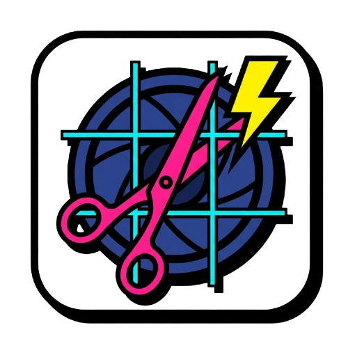
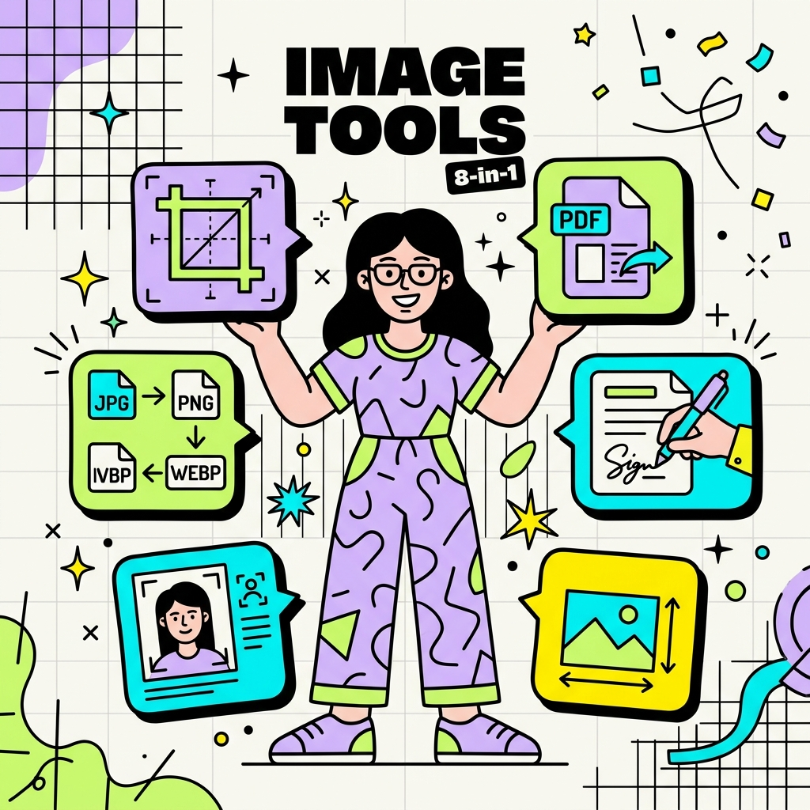
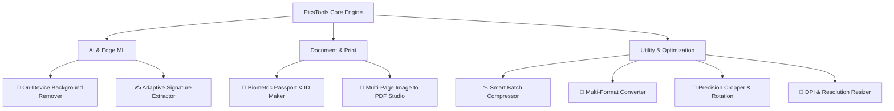
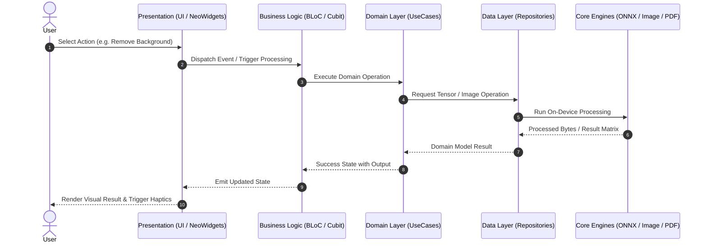
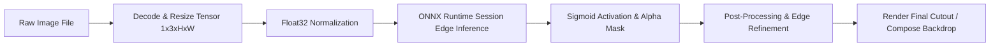
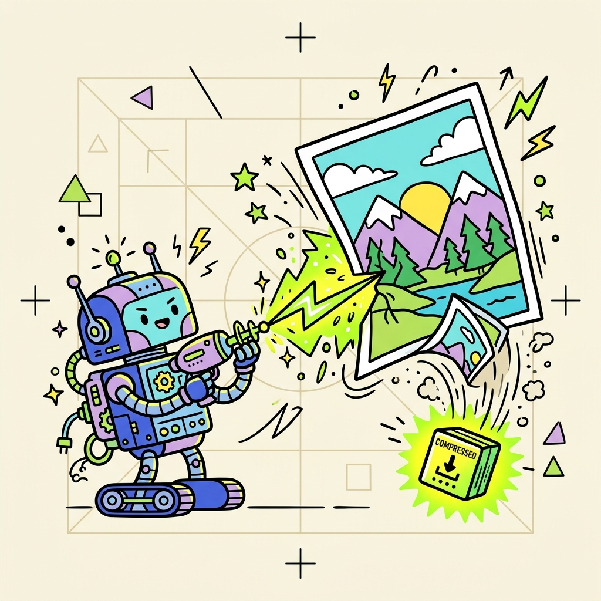
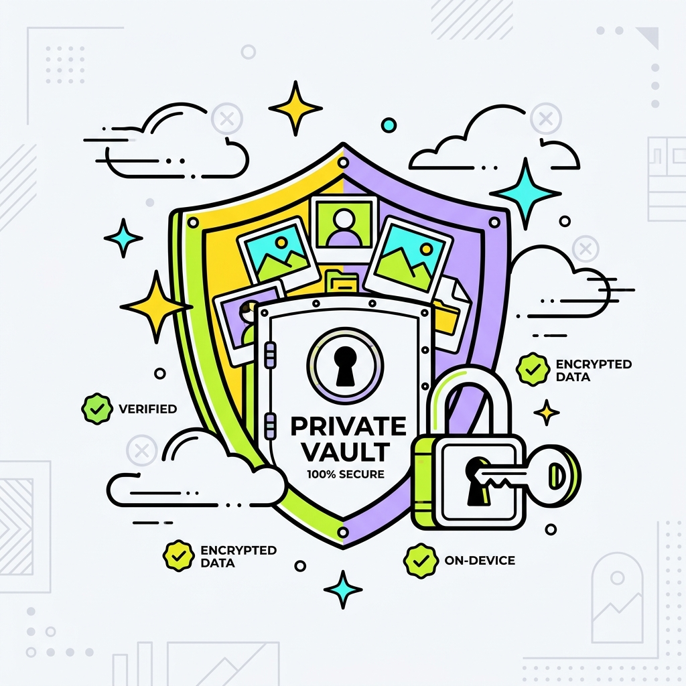

<div align="center">

  

# ⚡ PicsTools Studio

**Enterprise-Grade, Privacy-First, On-Device AI Image Processing Suite for iOS & Android**

[](https://flutter.dev)
[](https://dart.dev)
[](https://bloclibrary.dev)
[](https://onnxruntime.ai/)
[](#-commercial-readiness--monetization)
[-green?style=for-the-badge&logo=privatedivision&logoColor=white>)](#-privacy--security-first)

  <br />

  <p align="center">
    <a href="#-executive-summary">Executive Summary</a> •
    <a href="#-core-tool-suite">Core Tool Suite</a> •
    <a href="#-technical-architecture">Architecture</a> •
    <a href="#-edge-ai-pipeline">AI Pipeline</a> •
    <a href="#-commercial-readiness--monetization">Commercial & Pro</a> •
    <a href="#-getting-started">Getting Started</a> •
    <a href="#-project-structure">Project Structure</a>
  </p>

  

</div>

---

## 📌 Executive Summary

**PicsTools** is an all-in-one, commercial-ready mobile digital image laboratory designed for high-performance creative and professional workflows. Built with a modern **Neo-Brutalist UI design language**, strict **Clean Architecture**, and **on-device neural network execution (ONNX Runtime)**, PicsTools offers lightning-fast image transformations without transmitting sensitive user data to external cloud servers.

### 🌟 Why PicsTools?

| Dimension                       | PicsTools (On-Device Studio)                                             | Traditional SaaS Image Apps                          |
| :------------------------------ | :----------------------------------------------------------------------- | :--------------------------------------------------- |
| **Server Infrastructure Costs** | **$0.00 / user** (Zero cloud API fees)                                   | High recurring cloud GPU/API bills                   |
| **Data Privacy & Compliance**   | **100% Local Sandbox** (GDPR/CCPA compliant by design)                   | User photos uploaded & stored on third-party servers |
| **Offline Reliability**         | **Full functionality offline** (Airplanes, field work, low connectivity) | Fails or degrades without high-speed internet        |
| **Latency**                     | **Near-zero edge compute execution**                                     | Roundtrip network latency + queue wait times         |
| **Monetization Potential**      | **Built-in Freemium & Pro Paywall Architecture**                         | Margin erosion caused by per-operation cloud costs   |

---

## 🛠️ Core Tool Suite

PicsTools consolidates essential utilities into a single, cohesive, micro-animated studio.



### 1. 🤖 AI Background Remover (Edge ONNX)

- **Neural Segmentation**: Runs quantized deep learning segmentation models directly on-device using `flutter_onnxruntime`.
- **Instant Cutouts**: Generates transparent alpha channels in milliseconds with zero server dependencies.
- **Custom Backdrops**: Replace erased backgrounds with solid colors, gradient presets, transparent PNG, or custom blur effects.

### 2. 📉 Smart Batch & Target-Size Compressor

- **Size Targeting**: Accurately compress images to exact target thresholds (e.g., `< 200 KB` for official portal submissions).
- **Dual Engine**: Switch between aggressive lossy compression and perceptual lossless optimization.
- **Batch Processing**: Compress multiple images simultaneously with real-time compression delta analytics.

### 3. 🪪 Biometric ID & Passport Photo Studio

- **Global Compliance Presets**: Pre-configured aspect ratios and dimensions for US Visa/Passport (2x2 in), EU/Schengen/UK (35x45 mm), Canada, India, China, and custom sizes.
- **Compliance Backdrop Replacement**: Seamless single-tap background switching to official White, Off-White, Light Blue, or Grey standards.
- **Print Sheet Generator**: Automatically arranges multiple passport photos onto standard 4x6" or A4 photo sheets for cost-effective physical printing.

### 4. 📄 Multi-Page Image-to-PDF Studio

- **Document Assembly**: Reorder, rotate, and combine multiple high-resolution photos into a single optimized PDF document.
- **Quality & Layout Presets**: Custom margins, page orientations (Portrait/Landscape), and DPI downsampling to meet document upload limits.
- **Direct Printing**: Native integration with AirPrint and Android Print Spooler via `printing` and `pdf`.

### 5. ✍️ Digital Signature Extractor & Studio

- **Adaptive Thresholding**: Extract crisp digital ink signatures directly from photos of paper documents.
- **Canvas Signature Pad**: Vector-like signature drawing with adjustable pen thickness, smoothing, and color palette.
- **Transparent Export**: Export clean transparent PNG signatures or overlay them directly onto documents with 360° precision rotation.

### 6. 🔄 Multi-Format Converter

- **Wide Format Support**: Seamless conversion across **PNG**, **JPEG**, **WEBP**, **HEIC**, and **BMP**.
- **Quality & Metadata**: Granular quality sliders (1–100%) and configurable EXIF metadata retention.

### 7. 📐 Precision Cropper & Aspect Ratio Tool

- **Preset Grid Dimensions**: 1:1 (Square), 4:5 (Instagram Portrait), 16:9 (Landscape/YouTube), 9:16 (Stories/Reels/TikTok), 4:3, and Freeform.
- **Neo-Rotation & Perspective**: Haptic-backed 360° wheel control and arbitrary angle rotation.

### 8. 📏 Resolution & DPI Resizer

- **Pixel & Percentage Scaling**: Scale by explicit width/height dimensions or proportional percentage multipliers.
- **DPI Adjustment**: Re-encode print metadata for 300 DPI high-definition publishing.

---

## 🏗️ Technical Architecture

PicsTools adheres to strict **Clean Architecture** principles and the **BLoC (Business Logic Component)** pattern, ensuring separation of concerns, testability, and enterprise maintainability.

```
lib/
├── core/                           # Shared foundational modules
│   ├── constants/                  # Colors, tokens, dimensions, asset paths
│   ├── routing/                    # GoRouter declarative navigation tree
│   ├── services/                   # Service Locator (GetIt), Audio, Gallery
│   ├── theme/                      # Neo-Brutalist Theme System & Typography
│   ├── utils/                      # Byte converters, math, formatters
│   └── widgets/                    # Reusable Neo-buttons, cards, badges, dialogs
│
└── features/                       # Modular feature domains
    ├── background_remover/         # ONNX runtime inference, mask generation
    │   ├── data/                   # Model loaders, tensor preprocessing
    │   ├── domain/                 # Entity definitions, use cases
    │   └── presentation/           # BLoC, Views, Edge preview widgets
    ├── compressor/                 # Compression algorithms, batch state
    ├── converter/                  # Image codec encoding/decoding
    ├── cropper/                    # Crop canvas, aspect ratio matrices
    ├── id_photo/                   # Passport spec matrices, print sheets
    ├── pdf/                        # PDF document builder & print engine
    ├── signature/                  # Ink extraction, canvas drawing, overlay
    ├── resizer/                    # Dimension & DPI recalculation
    ├── pro/                        # In-App Purchase logic, paywall views
    ├── history/                    # Local processing logs & cache storage
    └── settings/                   # Theme toggle, auth sync, telemetry
```

### 🧩 Architectural Flow



---

## ⚡ Edge AI Pipeline

The on-device background remover runs deep learning inference directly on the client device without sending images over the network:



- **Runtime Engine**: `flutter_onnxruntime` with hardware acceleration where available.
- **Model Distribution**: Packaged directly within `assets/models/` or dynamically cached on first run to keep initial binary footprints minimal.
- **Memory Management**: Explicit tensor disposal and memory reuse to prevent OOM on low-end devices.

---

## 🎨 Design System: Neo-Brutalism

PicsTools features a custom **Neo-Brutalist UI Design Language** paired with **Space Grotesk** typography, giving it an unmistakable, modern, tactile feel that commands high user engagement.

<div align="center">
  
  
</div>

### Design Principles:

- **Bold 2.5px Dark Outlines**: Unambiguous visual boundaries and high-contrast styling.
- **Solid Offset Shadows (`4px / 6px`)**: Tactile button presses and physical depth feedback.
- **Vibrant Accent Palette**: High-energy Yellow (`#FFE600`), Cyan (`#00E5FF`), Neon Pink (`#FF3366`), and Mint Green (`#00E676`).
- **Complete Dark / Light Mode Parity**: Seamless theme switching with high readability across OLED and LCD displays.
- **Multi-Sensory Feedback**: Subtle sound effects (`audioplayers`) and vibration haptics on user actions.

---

## 💼 Commercial Readiness & Monetization

PicsTools is structured from the ground up as a sustainable, revenue-generating commercial application.

### 💎 Feature Gating & Paywall Matrix

| Feature                   |      Free Tier       |          Pro Subscription / Lifetime          |
| :------------------------ | :------------------: | :-------------------------------------------: |
| **Batch Compression**     |    Up to 3 images    |       ⚡ **Unlimited Batch Processing**       |
| **AI Background Removal** | Standard Resolution  |      🚀 **Ultra-HD / 4K Tensor Output**       |
| **Passport & ID Maker**   |  Basic Single Size   |  🪪 **All Global Standards + Print Sheets**   |
| **PDF Converter**         |    Up to 5 Pages     |  📑 **Unlimited Pages + Custom Watermarks**   |
| **Signature Extractor**   |   Standard Export    | ✍️ **Vector Smoothing + Multi-Layer Overlay** |
| **Export Formats**        |   Standard JPG/PNG   |    💎 **All Formats + Lossless WEBP/HEIC**    |
| **Advertisements**        | None (Privacy First) |        🛡️ **100% Ad-Free Experience**         |

### 💳 In-App Purchase Architecture

- Powered by `in_app_purchase` for seamless StoreKit (iOS) & Google Play Billing (Android) integration.
- Supports **Monthly**, **Annual (with trial period)**, and **Lifetime Purchase** SKUs.
- Built-in entitlement verification, receipt validation, and cross-device purchase restoration.
- Optional **Firebase Auth** account linking to sync pro subscriptions across user devices.

---

## 🔒 Privacy & Security First

```
   ┌─────────────────────────────────────────────────────────┐
   │                  USER MOBILE DEVICE                     │
   │                                                         │
   │   ┌──────────────┐     ┌──────────────┐     ┌─────────┐ │
   │   │ Camera /     │ ──> │ On-Device AI │ ──> │ Output  │ │
   │   │ Local Gallery│     │ & Transform  │     │ Gallery │ │
   │   └──────────────┘     └──────────────┘     └─────────┘ │
   │                              │                          │
   │                              ▼                          │
   │                    [ Local Sandbox Only ]               │
   └─────────────────────────────────────────────────────────┘
                                  ✕ (NO DATA TRANSFER)
   ┌─────────────────────────────────────────────────────────┐
   │                     EXTERNAL CLOUD                      │
   └─────────────────────────────────────────────────────────┘
```

- **Zero-Cloud Processing**: All compression, resizing, AI masking, and document generation occur 100% within the local sandbox.
- **No Third-Party Analytics Trackers**: User images never leave the device.
- **Regulatory Compliance**: Naturally compliant with **GDPR**, **CCPA**, and **HIPAA** guidelines regarding sensitive visual media.

---

## 🚀 Getting Started

### Prerequisites

- **Flutter SDK**: `>= 3.12.2` ([Install Flutter](https://docs.flutter.dev/get-started/install))
- **Dart SDK**: `>= 3.12.2`
- **Xcode** (for iOS builds, macOS required)
- **Android Studio / Android SDK** (for Android builds)

### 1. Clone the Repository

```bash
git clone https://github.com/al-fahad-bd/picstools.git
cd picstools
```

### 2. Install Dependencies

```bash
flutter pub get
```

### 3. Setup AI Models

Ensure the required quantized ONNX model file is placed in the assets directory:

```bash
# Model target location:
assets/models/
```

### 4. Run the Application

```bash
# Run on connected device or emulator in debug mode
flutter run

# Run with specific flavor / release mode
flutter run --release
```

### 5. Running the Test Suite

PicsTools includes a comprehensive suite of unit, widget, and domain tests:

```bash
# Run all unit and widget tests
flutter test

# Run tests with coverage output
flutter test --coverage
```

---

## 📦 Tech Stack & Key Dependencies

| Category                  | Package                                                                                                     | Purpose                                                        |
| :------------------------ | :---------------------------------------------------------------------------------------------------------- | :------------------------------------------------------------- |
| **State Management**      | [`flutter_bloc`](https://pub.dev/packages/flutter_bloc)                                                     | Predictable, reactive state management                         |
| **Dependency Injection**  | [`get_it`](https://pub.dev/packages/get_it)                                                                 | Fast service locator and inversion of control                  |
| **Routing**               | [`go_router`](https://pub.dev/packages/go_router)                                                           | Declarative, deep-linkable URL/route navigation                |
| **Edge AI Engine**        | [`flutter_onnxruntime`](https://pub.dev/packages/flutter_onnxruntime)                                       | High-performance on-device neural network execution            |
| **Image Manipulation**    | [`image`](https://pub.dev/packages/image)                                                                   | Pure Dart image decoding, encoding, and transformation         |
| **Document Processing**   | [`pdf`](https://pub.dev/packages/pdf) & [`printing`](https://pub.dev/packages/printing)                     | PDF generation, pagination, rasterization, and direct printing |
| **Monetization**          | [`in_app_purchase`](https://pub.dev/packages/in_app_purchase)                                               | Cross-platform Apple StoreKit & Google Play Billing            |
| **Authentication & Sync** | [`firebase_auth`](https://pub.dev/packages/firebase_auth)                                                   | Optional cloud account sync & profile backup                   |
| **Typography & Styling**  | [`google_fonts`](https://pub.dev/packages/google_fonts)                                                     | Space Grotesk dynamic typography integration                   |
| **Storage & Gallery**     | [`gal`](https://pub.dev/packages/gal) & [`shared_preferences`](https://pub.dev/packages/shared_preferences) | Native photo gallery export and key-value persistence          |

---

## 📱 Build & Deployment

### Android (App Bundle for Google Play)

```bash
# Generate app launcher icons
dart run flutter_launcher_icons

# Build release Android App Bundle (AAB)
flutter build appbundle --release
```

### iOS (IPA for App Store)

```bash
# Build release iOS archive
flutter build ipa --release
```

---

## 🗺️ Roadmap & Future Enhancements

- [ ] **AI Image Upscaler**: On-device super-resolution (ESRGAN edge model) for 2x/4x image enhancement.
- [ ] **Object Eraser / Inpainting**: On-device magic eraser for removing unwanted objects and blemishes.
- [ ] **OCR & Text Extractor**: Optical character recognition directly to PDF/Text from camera scans.
- [ ] **Batch Watermarking Studio**: Customizable text/logo watermarking with dynamic positioning and opacity.
- [ ] **Custom SVG / Vector Export**: Vectorizing high-contrast signatures and logos to SVG format.

---

## 📄 License & Attribution

This project is commercially licensed. All rights reserved.  
Designed and engineered with ❤️ by the **PicsTools Team**.

<div align="center">
  <sub>Built with Flutter • On-Device AI • Privacy First</sub>
</div>
